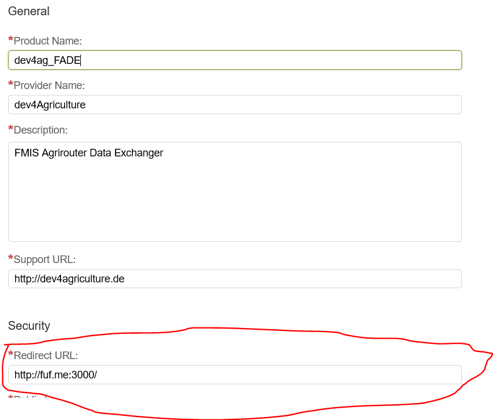
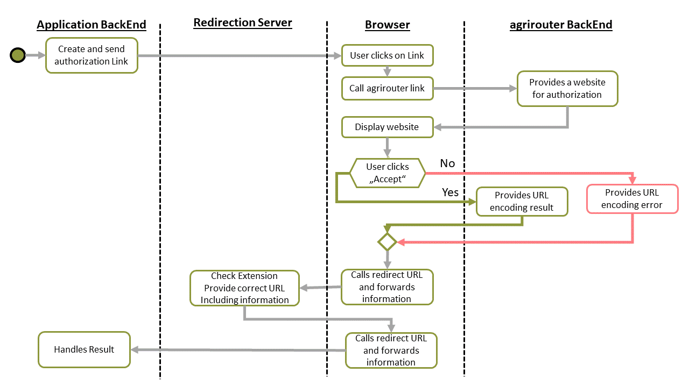

# agrirouter redirection server

## What is this repository about

When having more than 2 environments of your application, you might run into the issue, that those environments wait for agrirouter authorization response at different URLs. To fix this, here is an example microservice of a redirection Server.

The agrirouter Authorization URL provides a possibility to extend a URL (https://dev4agriculture.com/test instead of https://dev4agriculture.com), see redirect URI here:  <https://github.com/DKE-Data/agrirouter-interface-documentation/blob/develop/docs/integration/authorization.adoc>, however, it cannot be changed.
This is, what the agrirouter redirection server shall fix.

## What is agrirouter

Please refer to <https://www.my-agrirouter.com> for mor information.

## Setup in agrirouter

* Add a redirect URL to your application: 

This URL should point to your redirection microservice.

* Configure all Extensions by changing the variable "config" in index.json.

## Setup the redirect microservice

* Implement the specific extensions to use for the redirection in your source code
* Make sure, you encode the full url including the http:// for your redirect_uri and add the extension.

Example:

Your server URL: <http://dev4ag.com:3000/>

Extension: prod

Authorization URL: .....&redirect_uri=http%3A%2F%2Fdev4ag.com%3A3000%2Fprod

Please recognize, that the URL is URL-Encoded. For a fast test, see [this online tool](https://www.urlencoder.org/).

## How it works

When you call the Authoriation URL, agrirouter will redirect you to your redirection server. This server then checks the extension you added to the URL and redirects you again to a free configurable URL, including the full GET Queue received from agrirouter.

### Without redirection server

### With redirection server

## Important

The docker project is not yet tested!
